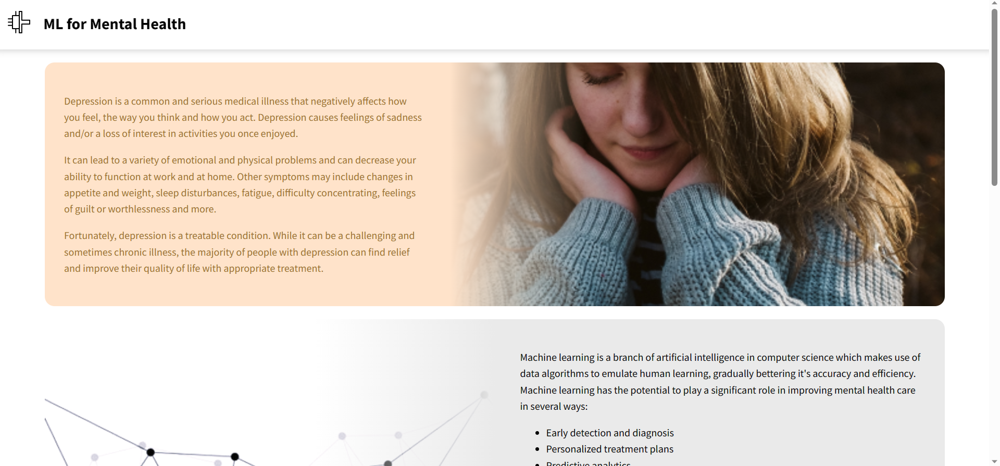
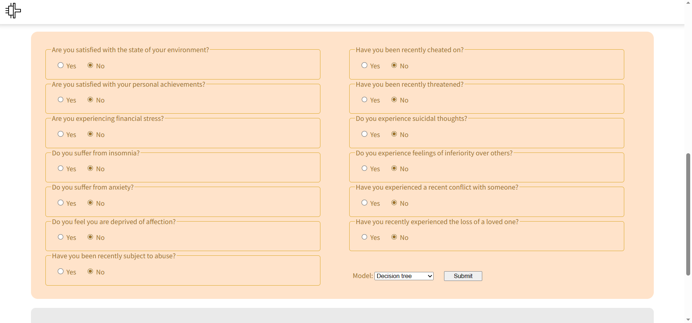
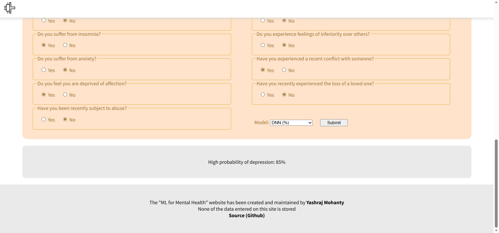

# Depression Detection System
## Overview
This is a web app called "ML for Mental Health". It uses machine learning and deep learning models to predict if a person is susceptible to depression using symptoms as input.  
Uses a variety of machine learning models like KNN, naive-bayes algorithm, random forest, logistic regression, SVM, decision tree as well as a feed forward DNN.

## Contents
It consists of the following:
- **Frontend**: An interface to input the required information. It allows the user to answer questions about mental health aspects as well as choose the type of model to run inference on.
- **Backend**: Python-based backend that accepts input, runs inference using the chosen model, and returns the results to the API. Primarily uses sklearn and keras.
- **API**: A flask API that handles requests from the frontend and passes the information to the backend. On receiving results from the backend, returns it to the frontend.

## Usage
In `DepressoWeb.js`, add your server URL in the `url` variable of the `submitResults` function. 

## Results/Gallery
Here's a glimpse of the frontend.

Here's where we input the information.

And the results are displayed here.

## Additional details
- Contains navigation bar animations which respond to scrolling
- Results div flashes different colors in response to the result